# soc-analyst-honeypot-home-lab

##  Objective

The objective of this project is to gain hands-on experience in building a cloud-based Security Operations Center (SOC) environment using Microsoft Azure and Microsoft Sentinel. The project focuses on deploying a Windows-based honeypot virtual machine to simulate real-world cyberattacks and generate security events for analysis. It involves configuring centralized log collection through Azure Log Analytics Workspace and integrating it with Microsoft Sentinel for threat monitoring and incident detection.

This lab captures security events such as failed login attempts and analyzes them using Kusto Query Language (KQL), enabling identification of malicious activity patterns. The project further enhances threat intelligence by enriching logs with GeoIP data and visualizing attack sources through an interactive attack map dashboard. This hands-on exercise strengthens practical skills in SIEM operations, threat detection, log analysis, and cloud security monitoring, which are essential for SOC Analyst and cybersecurity roles.

## Skills Learned

- Gained hands-on experience in cloud security monitoring using Microsoft Azure and Microsoft Sentinel, including setting up a SOC-style environment for threat detection.  
- Worked with Windows Security Event Logs to analyze failed login attempts and investigate suspicious activity.  
- Developed practical skills in Kusto Query Language (KQL) to query, filter, and analyze security events.  
- Deployed and configured a Windows virtual machine in Azure and managed network security settings using NSG rules.  
- Implemented centralized log collection using Azure Log Analytics Workspace and integrated it with Microsoft Sentinel for SIEM operations.  
- Applied basic threat intelligence techniques by enriching logs with GeoIP data to identify attacker locations.  
- Built an attack visualization dashboard using Sentinel Workbooks to understand attack patterns and improve incident awareness.

## Tools Used

- Microsoft Azure – Cloud platform used to deploy and manage virtual machines and networking resources  
- Microsoft Sentinel – Cloud-native SIEM used for log monitoring, threat detection, and security analysis  
- Log Analytics Workspace – Centralized log storage and analysis platform for security event data  
- Windows 10 Virtual Machine – Used as a honeypot system to simulate real-world attack scenarios  
- Azure Monitor Agent (AMA) – Used to collect and forward security logs to Log Analytics Workspace  
- Kusto Query Language (KQL) – Used for querying and analyzing security logs and events  
- GeoIP Watchlist – Used for enriching logs with geographic information of attacker IP addresses  
- Sentinel Workbooks – Used for creating dashboards and visualizing attack patterns

## Architecture Diagram

The following diagram illustrates the SOC monitoring architecture implemented using Microsoft Azure and Microsoft Sentinel.

<p align="center">
  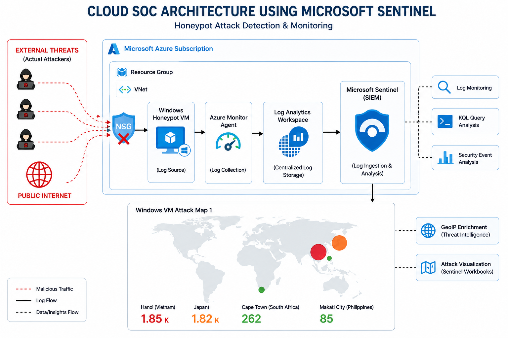
</p>

## ⚙️ STEPS

---

### 1. Resource Group Creation

Created a new Resource Group in Microsoft Azure to organize and manage all resources used in the SOC lab.

<p align="center">
  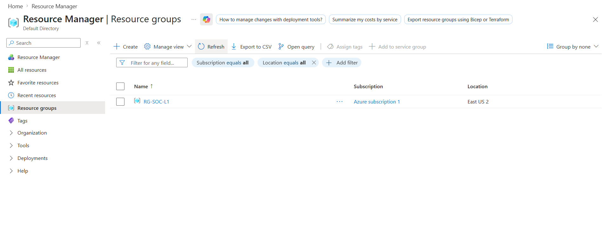
</p>

**Fig 1.1** – Resource group created in Microsoft Azure portal for SOC lab environment.

---

### 2. Virtual Machine Deployment

Deployed a Windows 10 virtual machine in Microsoft Azure to act as a honeypot system for simulating attack scenarios.

<p align="center">
  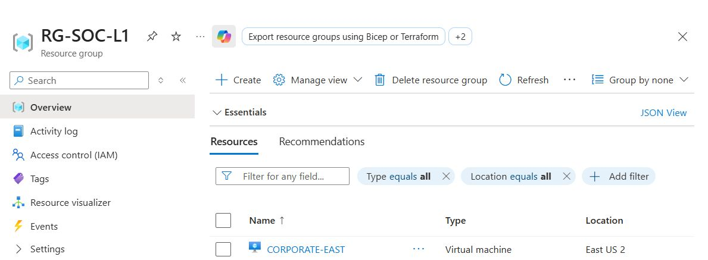
</p>

**Fig 1.2** – Windows 10 virtual machine successfully created in Azure.

---

### 2. Virtual Network (VNet) Creation

Created a Virtual Network (VNet) to provide network isolation and support connectivity for the virtual machine within the SOC lab environment.

<p align="center">
  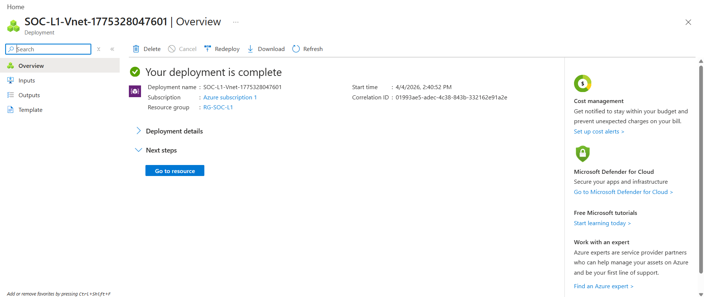
</p>

**Fig 1.2** – Virtual Network created to support secure communication within the Azure SOC environment.

---

### 3. Network Security Group (NSG) Configuration

Configured Network Security Group (NSG) inbound rules to allow all traffic, enabling simulated malicious access attempts for the honeypot environment.

<p align="center">
  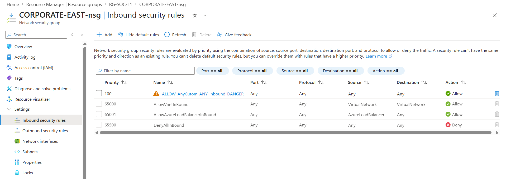
</p>

**Fig 1.3** – NSG inbound rule configured to allow unrestricted traffic for honeypot simulation.

---

### 4. Resource Group Overview

Created a Resource Group in Microsoft Azure to organize and manage all resources used in the SOC lab environment, including the virtual machine, virtual network and networking components.

<p align="center">
  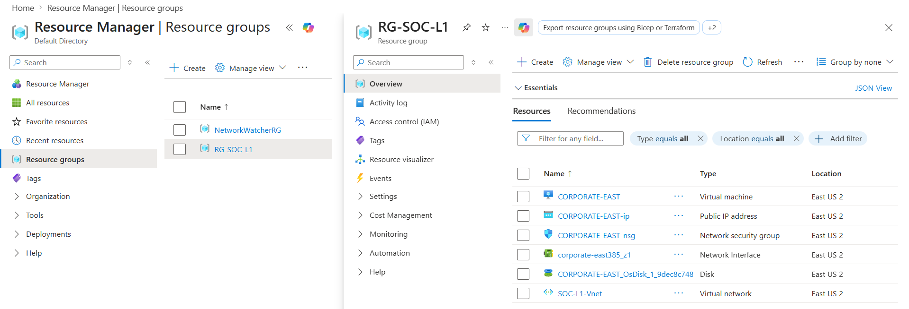
</p>

**Fig 1.4** – Resource Group showing all deployed SOC lab resources.
---

### 5. Windows Firewall Disabled

Disabled Windows Defender Firewall inside the virtual machine across Domain, Private, and Public profiles to allow unrestricted inbound traffic for attack simulation in the honeypot environment.

<p align="center">
  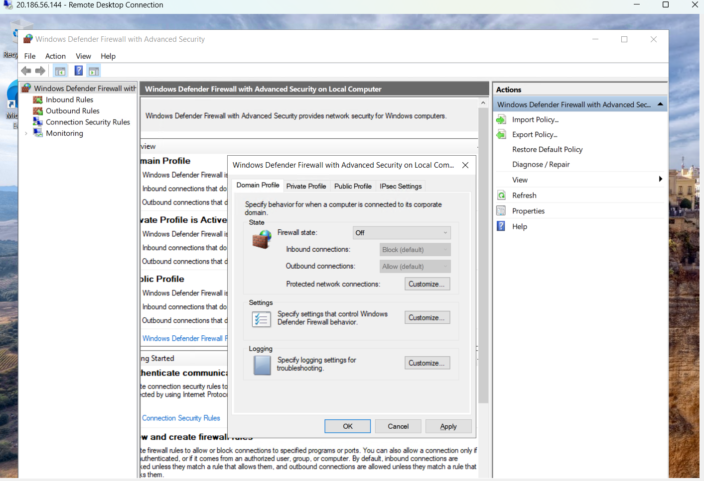
</p>

**Fig 1.5** – Windows Defender Firewall turned off for Domain, Private, and Public network profiles on the honeypot VM.

---

### 6. Failed Login Attempts (Attack Simulation)

Observed failed login attempts on the honeypot virtual machine, simulating brute-force attack activity and generating security logs for analysis.

<p align="center">
  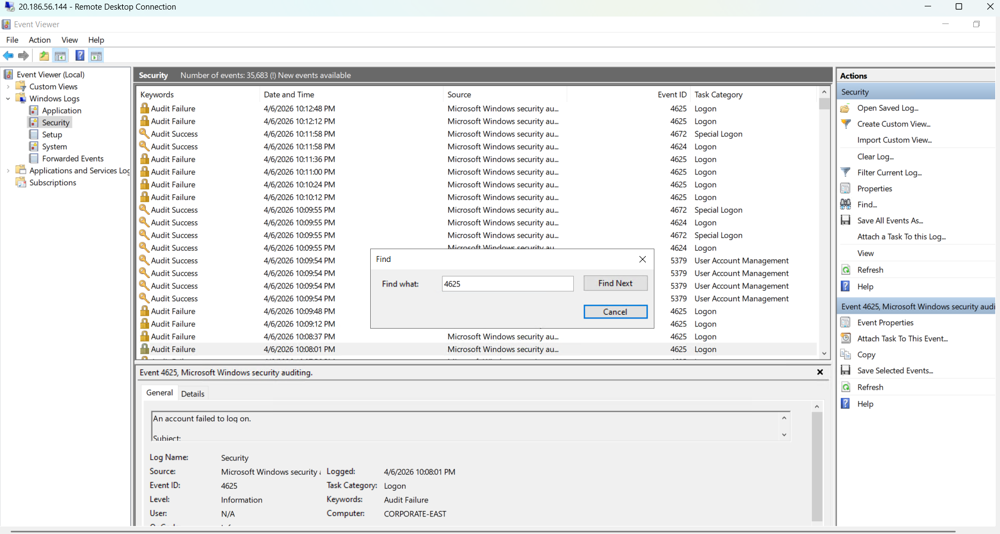
</p>

**Fig 1.6** – Event Viewer showing multiple failed login attempts (Event ID 4625) triggered by external access attempts.

---

### 7. Log Analytics Workspace Setup

Created a Log Analytics Workspace to collect and store security event logs from the virtual machine for centralized monitoring and analysis.

<p align="center">
  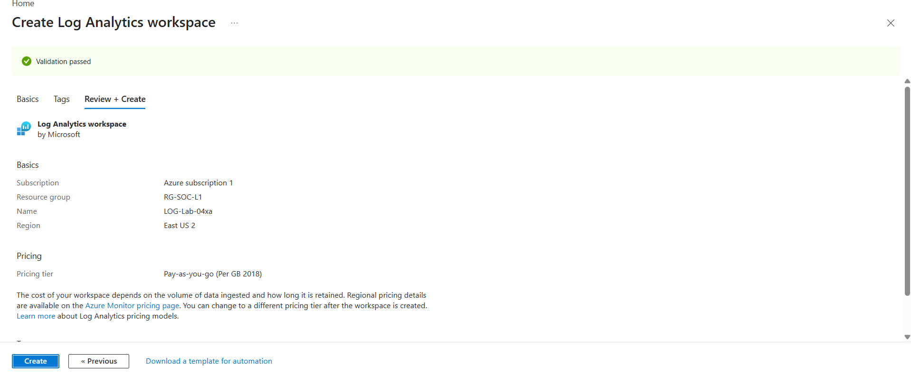
</p>

**Fig 1.7** – Log Analytics Workspace configured for centralized log storage and log ingestion from the SOC environment.

---

### 8. Microsoft Sentinel Integration

Connected the Log Analytics Workspace with Microsoft Sentinel to enable SIEM-based monitoring, threat detection, and security analytics.

<p align="center">
  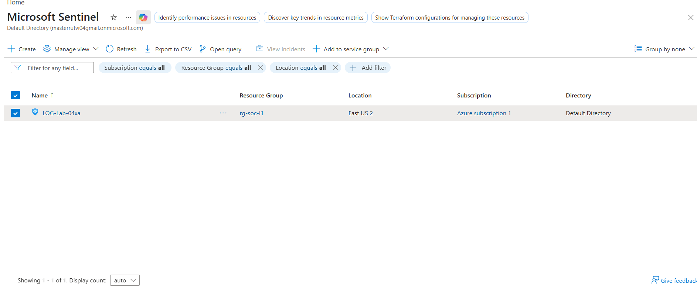
</p>

**Fig 1.8** – Microsoft Sentinel successfully integrated with Log Analytics Workspace for centralized security monitoring.

---

### 9. Azure Monitor Agent (AMA) Configuration

Configured the Azure Monitor Agent (AMA) and Data Collection Rule (DCR) to forward Windows security event logs from the honeypot virtual machine to the Log Analytics Workspace.

<p align="center">
  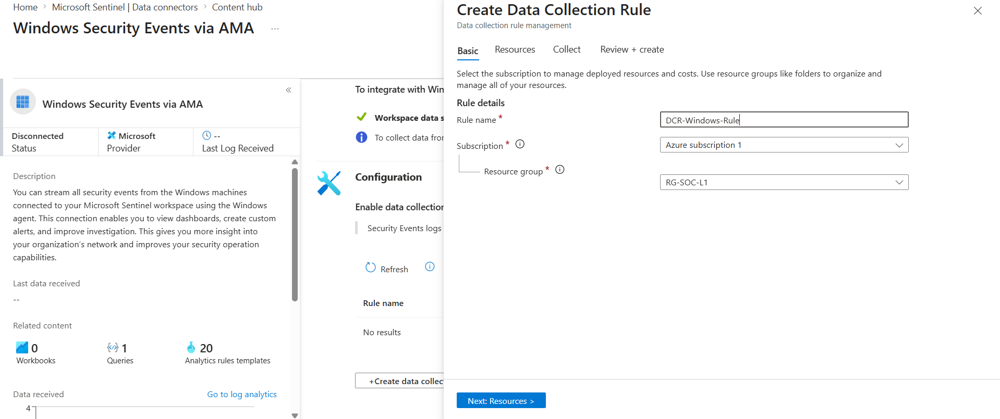
</p>

<br>

<p align="center">
  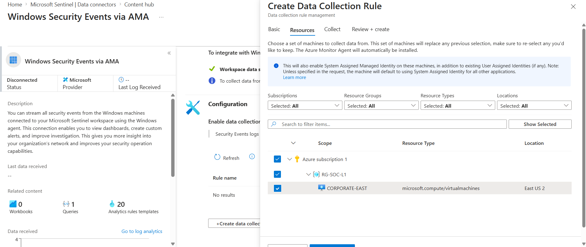
</p>

<br>

<p align="center">
  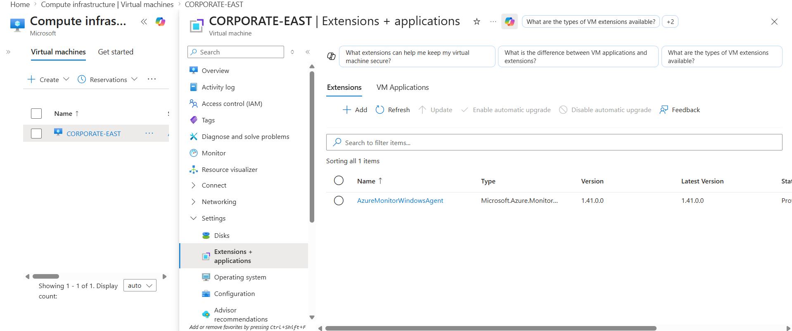
</p>

 **Fig 1.9** – Azure Monitor Agent and Data Collection Rule configured for centralized security log collection.

---

### 10. Windows Security Logs Ingestion

Verified that Windows Security Event Logs from the honeypot virtual machine are successfully being ingested into the Log Analytics Workspace after configuring the Azure Monitor Agent and Data Collection Rule.

<p align="center">
  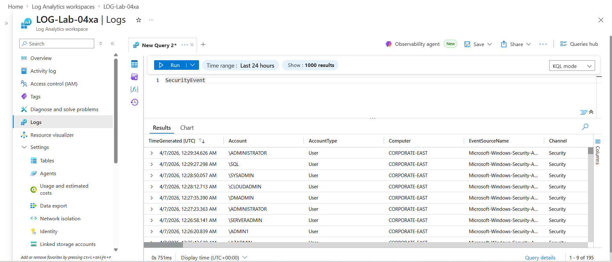
</p>

**Fig 1.10** – Windows Security Events successfully received in Log Analytics Workspace (proof of log ingestion from the VM).

### 11. KQL Log Analysis

Executed multiple Kusto Query Language (KQL) queries in Microsoft Sentinel / Log Analytics Workspace to analyze failed login attempts and detect suspicious activity on the honeypot virtual machine.

---

### 1. Failed Login Attempts (Event ID 4625)

```kql
SecurityEvent
| where EventID == 4625
| project TimeGenerated, Account, Computer, EventID, Activity, IpAddress
```

<p align="center"> 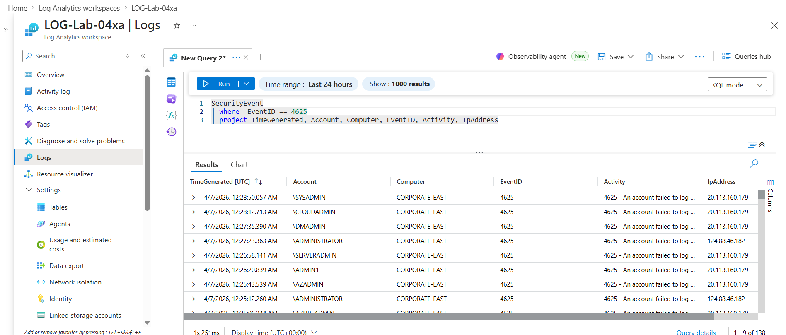 </p>
Fig 1.11.1 – Query used to identify failed login attempts (Event ID 4625).

---

### 2. Recent Failed Login Attempts (Last 5 Minutes)

```kql
SecurityEvent
| where EventID == 4625
| where TimeGenerated > ago(5m)
| project TimeGenerated, Account, Computer, EventID, Activity, IpAddress
```

<p align="center">  </p>
Fig 1.11.2 – Query filtering failed login attempts within the last 5 minutes.

### 3. pecific Account Monitoring 

```kql
SecurityEvent
| where Account == "\\MICHAEL"
```

<p align="center"> 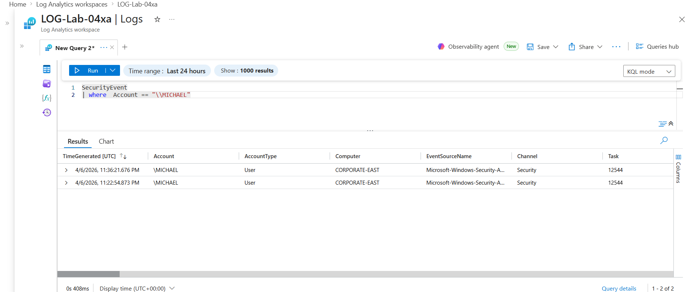 </p>
Fig 1.11.3 – Query filtering events for a specific user account.

### 4. Account Activity with Projected Fields

```kql
SecurityEvent
| where Account == "\\MICHAEL"
| project TimeGenerated, Account, Computer, EventID, Activity, IpAddress
```

<p align="center"> 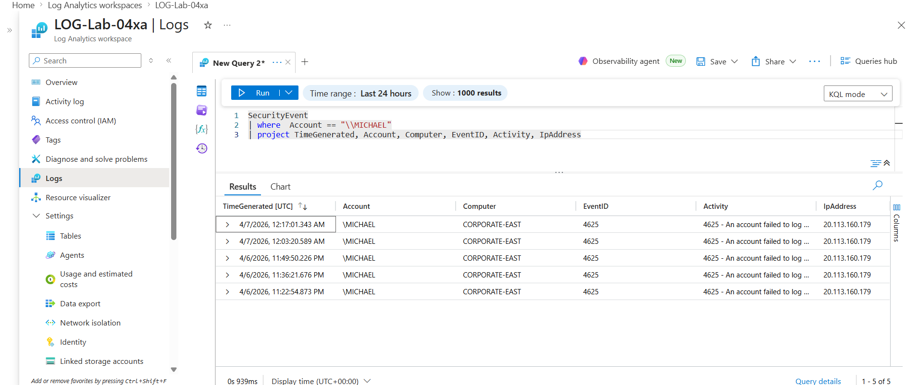 </p>
Fig 1.11.4 – Structured view of account-based activity logs.

---

### 5. GeoIP Enrichment – Failed Login Attempts from Specific IP

```kql
let GeoIPDB_FULL = GetWatchlist("geoip");

let WindowsEvents = SecurityEvent
| where IpAddress == "124.88.46.182"
| where EventID == 4625
| order by TimeGenerated desc;

WindowsEvents
| evaluate ipv4_lookup(GeoIPDB_FULL, IpAddress, network)
```
<p align="center"> 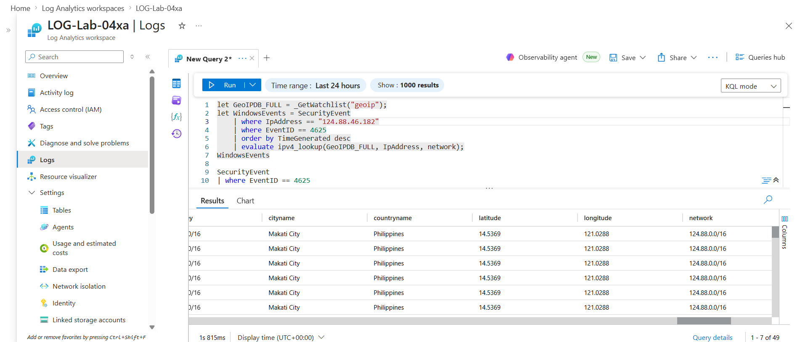 </p>
Fig 1.11.5 – Failed login attempts enriched with GeoIP data for attacker IP address.

### 6.  GeoIP Mapping with Location Enrichment

```kql
let GeoIPDB_FULL = GetWatchlist("geoip");

let WindowsEvents = SecurityEvent
| where IpAddress == "124.88.46.182"
| where EventID == 4625
| order by TimeGenerated desc;

WindowsEvents
| evaluate ipv4_lookup(GeoIPDB_FULL, IpAddress, network)
| project TimeGenerated, Computer, IpAddress, cityname, countryname, latitude, longitude
```

<p align="center"> 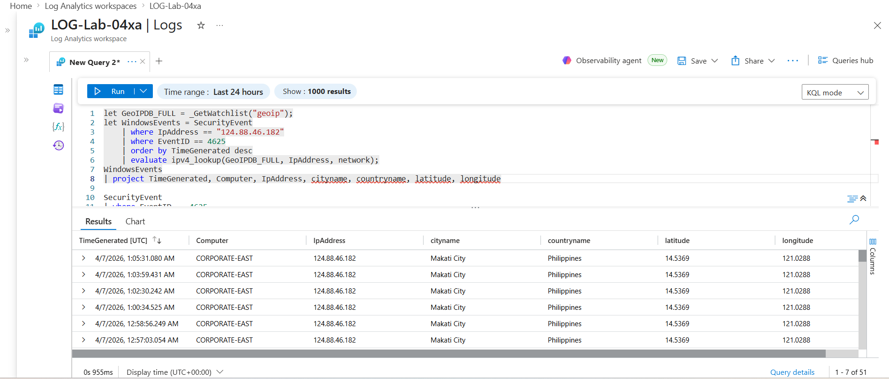 </p>
Fig 1.11.6 – Mapping attacker IP address to geographical location using GeoIP watchlist.

### 7. Full Threat Location Analysis (Attacker Tracking)

```kql
let GeoIPDB_FULL = GetWatchlist("geoip");

let WindowsEvents = SecurityEvent
| where IpAddress == "124.88.46.182"
| where EventID == 4625
| order by TimeGenerated desc;

WindowsEvents
| evaluate ipv4_lookup(GeoIPDB_FULL, IpAddress, network)
| project TimeGenerated, Computer, AttackerIP = IpAddress, cityname, countryname, latitude, longitude
```

<p align="center"> 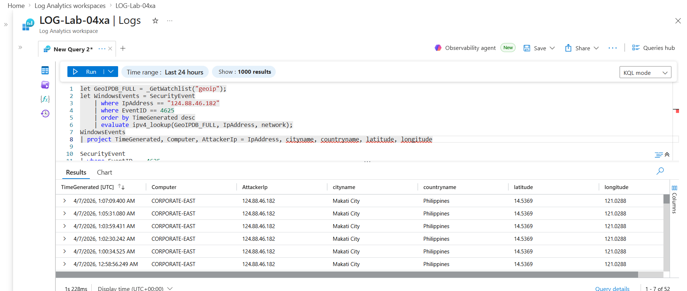 </p>
Fig 1.11.7 – End-to-end attacker tracking using GeoIP enrichment and failed login logs.
